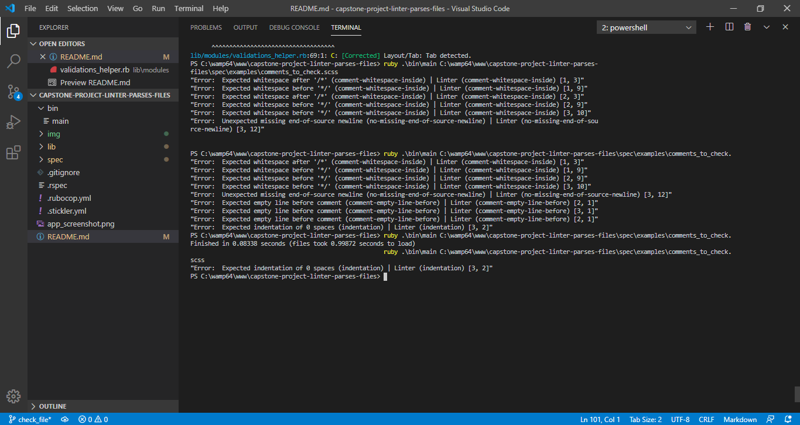

<p align="center">
    
</p>

<p align="center">
    <h1 align="center"> SASS Linter with Ruby</h1>    
</p>

<p align="center">
    <h2 align="center">      <h2 align="center">  Command line application to check sintax of SCSS files</h2>    
</h2>    
</p>


<p align="center">
    <a href="https://img.shields.io/badge/Microverse-blueviolet" alt="Contributors">
        </a>
    <a href="https://ruby-doc.org/core-2.7.0/Array.html" alt="Ruby">
        </a>
    <a href="https://sass-lang.com/" alt="SASS">
        </a>
    <a href="https://www.rubyguides.com/ruby-tutorial/object-oriented-programming/" alt="OOP">
        </a>
    <a href="http://ruby-for-beginners.rubymonstas.org/advanced/modules.html" alt="OOP">
        </a>
    <a href="#" alt="Rspec">
        </a>


</p>

  <p align="center">    
    <br />
    <a href="https://github.com/rubenpazch/capstone-project-linter-parses-files"><strong>Explore this project »</strong></a>
    <br />
    <br />&#10023;
    <a href="https://repl.it/@RubenPaz/capstone-project-linter-parses-files">View Demo</a>   &#10023;  
    <a href="https://github.com/rubenpazch/capstone-project-linter-parses-files/issues">Report Bug</a>    &#10023;
    <a href="#Getting-Started">Getting Started</a> &#10023; 
    <a href="#Install">Installing</a> &#10023;
    <a href="#Whats-is-included-on-this-project">Whats is included on this project</a> &#10023;
    <a href="#Video-Presentation-of-the-project">Video Presentation of the project</a> &#10023;
    <a href="#authors">Author</a> &#10023;
     
  </p>


<br/>


<b>SASS linter with Ruby is a command-line application </b> built entirely with Ruby, like a developer sometimes we have some rules to follow in order to apply good practices in our code, writing good code is always good, it helps other programmers to maintain them the application, this app checks if you had written your code not using good practices and left you to know which the line and column that need to be changed in order to have a clean code, for example <b> (Comment white space inside after, Comment white space inside before, Unexpected missing end of source newline, Expected empty line before the comment, Expected indentation of zero spaces, Expected indentation of 2 spaces) </b>.

<br/>



<br/>


## Getting Started

This project was built using Ruby, it is a command-line application and for running on your local environment you should follow these guidelines.

The **_SASS Linter_** does basic syntax checking, as well as applying a set of rules to the code and throws back an error if bad syntax is found.
The throwback error is being printed out indicating the line and column of the specific syntax issue.


### Prerequisites

- Ruby 2.6.5
- Git
- have **Ruby** installed on your computer


### Setup

The project repository can be found in [GitHub link](https://github.com/rubenpazch/capstone-project-linter-parses-files) or just clone the project using this command. 


```
Using SSH 

# git clone  git@github.com:rubenpazch/capstone-project-linter-parses-files.git

Using HTTPS

# git clone  https://github.com/rubenpazch/capstone-project-linter-parses-files.git

```

+ Open terminal on your workspace with

```
cd /home/workspace/capstone-project-linter-parses-files
```


## Install

To install Ruby please follow this tutorial:


[Ruby Programming Installing Ruby](https://www.theodinproject.com/courses/ruby-programming/lessons/installing-ruby-ruby-programming)


To get started with the app, clone the repo, and then install the needed gems:

```
# bundle install --without production
```


### Usage


* Navigate to root directory of the repo and run on windows:
```
$ ruby ./bin/main path_to_file.scss (path_to_file being the file you want to check for linters)
```

* Navigate to root directory of the repo and run on ubuntu:
```
$ main path_to_file.scss (path_to_file being the file you want to check for linters)
```


### Run tests


To run the test cases with RSpec we have to follow this steps:

installing RSpec

    gem install rspec

Once that’s done, you can verify your version of RSpec with, for this project we had used the version 3.9 

    rspec --version

finally run for watch the results

    rspec


### Link to assignment

the assignment can be found  [here](https://www.notion.so/microverse/Build-your-own-linter-b17a3c22f7b940c98ca1980250720769).


### Built With

Concepts used on this project

- Ruby
- SASS
- OOP 
- Modules 

### Tools used on this project

- Stickler CI
- Visual Studio Code- 
- Rubocop


### Project structure

For this project we have the next structure.

+ bin
	+ main
+ img
+ lib
	+ modules
+ spec


## Whats is included on this project

This project includes the next parts:

+ SASS linter validations
	+ Comment white space inside after
	+ Comment white space inside before
	+ Unexpected missing end of source newline
	+ Expected empty line before comment
	+ Expected indentation of zero spaces
	+ Expected indentation of 2 spaces

+ RSpec test cases


### Rules

Comment white space inside after

Bad code: 
```CSS
/*comment */
```
Good code:
```CSS
/* comment */
```

Comment white space inside before

Bad code: 
```CSS
/* comment*/
```
Good code:
```CSS
/* comment */
```

Unexpected missing end of source newline

Bad code: 
```CSS
/* comment */
```
Good code:
```CSS
/* comment */

```

Expected empty line before comment

Bad code: 
```CSS
/* comment */
/* comment */
```
Good code:
```CSS
/* comment */

/* comment */
```

Expected indentation of zero spaces

Bad code: 
```CSS
       /* comment*/
```
Good code:
```CSS
/* comment */
```

Bad code: 
```CSS
  .enlarge {
	font-size: 14px;
```
Good code:
```CSS
.enlarge {
	font-size: 14px;
```


Bad code: 
```CSS
  #enlarge {
	font-size: 14px;
```
Good code:
```CSS
#enlarge {
	font-size: 14px;
```

Expected indentation of 2 spaces

Bad code: 
```CSS
/* comment */

.enlarge {
font-size: 14px;
}
```
Good code:
```CSS
/* comment */

.enlarge {
  font-size: 14px;
}
```


## Video Presentation of the project

You can see the loom presentation on the next link [here](https://www.loom.com/share/1705cb9cd0c747e4aa8a86cc7ed38adb).


## Authors

👤 **Ruben Paz Chuspe**

- Github: [@rubenpazch](https://github.com/rubenpazch)
- Linkedin: [rubenpch](https://www.linkedin.com/in/rubenpch/)
- Twitter: [@ChuspePaz](https://twitter.com/ChuspePaz)


## Contributing

This is an education project as a part of the Microverse so contributing is not accepted. 

Contributions, issues and feature requests are welcome!

Feel free to check the [issues](https://github.com/rubenpazch/capstone-conference-page/issues).


## Show your support

Give a ⭐️ if you like this project!


## Acknowledgements

+ [Microverse](https://www.microverse.org/).
+ [Github](http://github.com/).
+ [Fontawesome](http://fontawesome.com/).
+ [The Odin Project](theodinproject.com/).


## License

This project is [MIT](lic.url) licensed.


